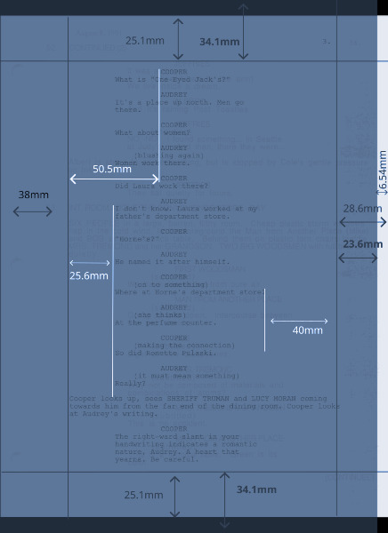

> 26/Apr/2026/14:29

# the film_script formatting rules

There are two variants of the film_script formatting rules, **film_script_i** and **film_script_h**.

### • film_script_i 
_(indentation-based; to be used a simple text editor)_

```
|- - - - - 5 tabs << character name (dialogue)
|- - - - 4 tabs << parenthetical
|- - - 3 tabs << dialogue
|- -  2 tabs << no meaning :) could be used later
|- 1 tab << action description
|0 tab << scene heading

“>” -> cut / dissolve / more, etc
```


### • film_script_h 
_(heading-level based; to be used in Libreoffice Writer)_

```
Heading 1 -> (reserved for chapter / section titles)
Heading 2 -> scene heading
h3 -> CHARACTER (dialogue)
h4 -> dialogue
h5 -> parenthetical
h6 -> more / dissolve / cut .. etc.
body text -> action description

To these, native shortkeys are available:
CTRL+1 -> h1, CTRL +2 ->h2, CTRL + 0 -> body text`
```

When exported to (saved as) markdown, these will translate like this:

```
h1 -> #
h2 ->  ##
h3 - h6 -> ###...
body text -> nothing (1 indent can be added at conversion)
```
________

### document layout / "formatting" in a screenplay 
_(the illustration below uses metric units, values are approximate, **only for illustration purposes** :) )_

_It also illustrtrates the difference between a European A4 and the US Letter formats._

> The screenplay used in this illustration, as you may have noticed, is _Twin Peaks_ (episode 3).


